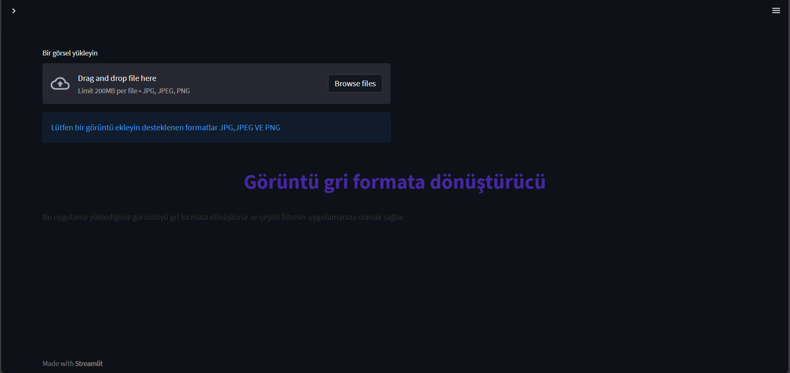
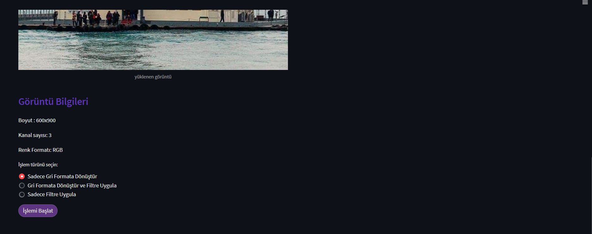
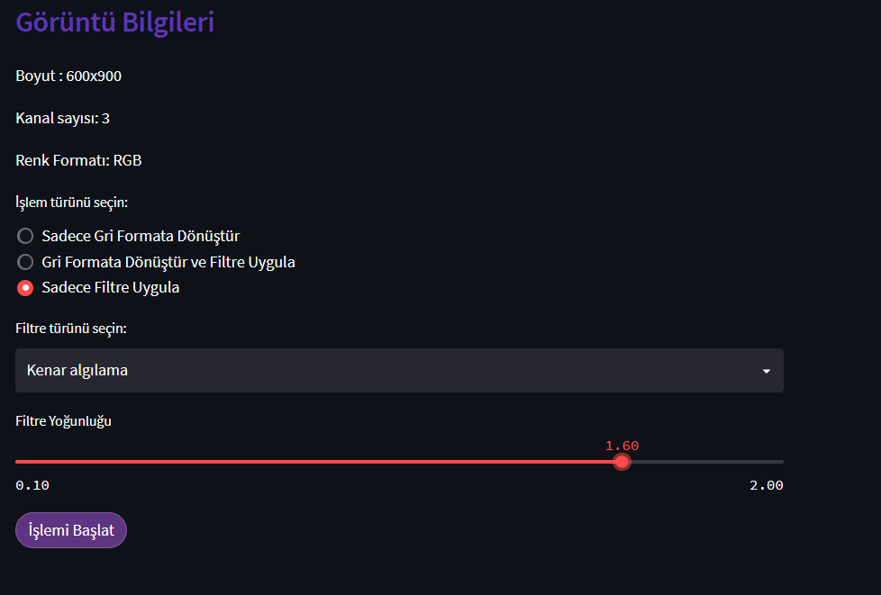
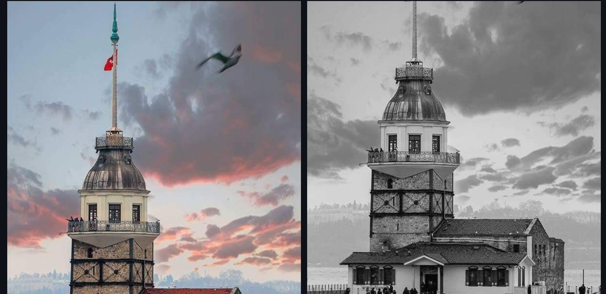
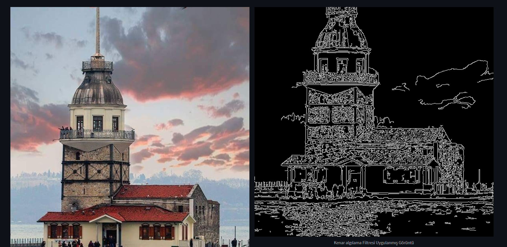

## 🖥️ Application Preview

  
  

  
  

  

# 🎨 Image Processing Web App (Streamlit + OpenCV)

This project is a simple and interactive image processing web application built with **Streamlit** and **OpenCV**.  

Users can:
- Convert images to grayscale
- Apply different image filters
- Adjust filter intensity
- Download processed images

---

## 📌 Features

✅ Grayscale Conversion  
✅ Blur Filter  
✅ Sharpen Filter  
✅ Edge Detection  
✅ Negative Effect  
✅ Adjustable Filter Intensity  
✅ Image Download Option  
✅ User-Friendly Web Interface  

---

## 🛠️ Technologies Used

- Python
- Streamlit
- OpenCV
- NumPy
- Pillow

---

## 📷 How It Works

1. Upload an image (JPG, JPEG, PNG).
2. Choose a processing option:
   - Only Grayscale
   - Grayscale + Filter
   - Only Filter
3. Select filter type and intensity (if needed).
4. Click **Start Processing**.
5. Download the processed image.
🔬 Technical Overview

This application is built as an interactive image processing system that integrates Streamlit for the user interface and OpenCV for backend image processing operations. The system follows a structured pipeline starting from image acquisition, preprocessing, transformation, and finally rendering the processed output to the user interface.

When a user uploads an image, the file is first read using the Pillow (PIL) library. The image is then converted into a NumPy array to ensure compatibility with OpenCV operations. Since OpenCV processes images as matrix representations of pixel intensity values, each image is handled as a multidimensional numerical array.

For grayscale conversion, the RGB image is transformed into a single-channel intensity representation. This reduces computational complexity and dimensionality from three channels (Red, Green, Blue) to one intensity channel. The grayscale transformation preserves structural information while eliminating color data, which is especially useful for edge detection and filtering operations.

Filtering operations are implemented using convolution-based techniques. In the blur operation, a Gaussian kernel is applied to the image matrix to reduce noise and high-frequency components. The kernel size is dynamically adjusted according to the user-defined intensity parameter. In sharpening, a high-pass convolution kernel is used to enhance edges by amplifying differences between neighboring pixel values.

For edge detection, the Canny algorithm is applied. This multi-stage algorithm includes noise reduction, gradient computation, non-maximum suppression, and double thresholding with hysteresis. The threshold values are scaled based on the selected intensity level, enabling dynamic control over edge sensitivity.

The negative transformation is implemented by inverting pixel intensity values using a simple linear transformation (255 - pixel_value), effectively reversing brightness distribution.

All processed images are converted back into PIL Image format for rendering within the Streamlit interface. The final output can also be exported as a PNG file using an in-memory buffer system.

From a software architecture perspective, the project follows a modular design approach. Image loading, grayscale conversion, filtering logic, and UI components are separated into independent functions. This improves maintainability, readability, and scalability of the codebase.

Overall, this project demonstrates practical implementation of fundamental computer vision techniques, matrix-based image manipulation, convolution operations, and interactive web deployment using Python-based tools.

---

# 🎨 Görüntü İşleme Web Uygulaması (Streamlit + OpenCV)

Bu proje, **Streamlit** ve **OpenCV** kullanılarak geliştirilmiş basit ve etkileşimli bir görüntü işleme web uygulamasıdır.

Kullanıcılar:

- Görüntüyü gri formata dönüştürebilir
- Farklı filtreler uygulayabilir
- Filtre yoğunluğunu ayarlayabilir
- İşlenmiş görüntüyü indirebilir

---

## 📌 Özellikler

✅ Gri Formata Dönüştürme  
✅ Bulanıklaştırma Filtresi  
✅ Keskinleştirme Filtresi  
✅ Kenar Algılama  
✅ Negatif Efekt  
✅ Ayarlanabilir Filtre Yoğunluğu  
✅ Görüntü İndirme Özelliği  
✅ Kullanıcı Dostu Web Arayüzü  

---

## 🛠️ Kullanılan Teknolojiler

- Python
- Streamlit
- OpenCV
- NumPy
- Pillow

---

## 📷 Nasıl Çalışır?

1. JPG, JPEG veya PNG formatında bir görüntü yükleyin.
2. İşlem türünü seçin:
   - Sadece Gri Formata Dönüştür
   - Gri Formata Dönüştür + Filtre Uygula
   - Sadece Filtre Uygula
3. Gerekirse filtre türünü ve yoğunluğunu belirleyin.
4. **İşlemi Başlat** butonuna tıklayın.
5. İşlenmiş görüntüyü indirin.

🔬 Teknik Genel Bakış

Bu uygulama, kullanıcı arayüzü için Streamlit ve arka plandaki görüntü işleme işlemleri için OpenCV kullanılarak geliştirilmiş etkileşimli bir görüntü işleme sistemidir. Sistem; görüntü alımı, ön işleme, dönüşüm ve son olarak işlenmiş çıktının kullanıcı arayüzünde gösterilmesi aşamalarından oluşan yapılandırılmış bir işleme hattını takip eder.

Kullanıcı bir görüntü yüklediğinde, dosya ilk olarak Pillow (PIL) kütüphanesi kullanılarak okunur. Ardından görüntü, OpenCV işlemleriyle uyumlu hale getirmek için NumPy dizisine dönüştürülür. OpenCV, görüntüleri piksel yoğunluk değerlerinden oluşan matrisler şeklinde işlediği için her görüntü çok boyutlu sayısal bir dizi olarak ele alınır.

Gri tonlamaya dönüştürme işleminde, RGB formatındaki görüntü tek kanallı bir yoğunluk temsiline çevrilir. Bu işlem, üç kanallı (Kırmızı, Yeşil, Mavi) yapıdan tek kanallı bir yoğunluk matrisine geçiş yaparak boyutsallığı ve hesaplama maliyetini azaltır. Gri tonlama dönüşümü, renk bilgisini ortadan kaldırırken yapısal bilgiyi korur. Bu özellik özellikle kenar algılama ve filtreleme işlemlerinde avantaj sağlar.

Filtreleme işlemleri, konvolüsyon (evrişim) temelli teknikler kullanılarak gerçekleştirilir. Bulanıklaştırma işleminde, yüksek frekanslı bileşenleri ve gürültüyü azaltmak amacıyla görüntü matrisine Gaussian çekirdeği uygulanır. Çekirdek boyutu, kullanıcı tarafından belirlenen yoğunluk parametresine göre dinamik olarak ayarlanır. Keskinleştirme işleminde ise yüksek geçiren (high-pass) bir konvolüsyon çekirdeği kullanılarak komşu piksel değerleri arasındaki farklar artırılır ve kenarlar belirginleştirilir.

Kenar algılama için Canny algoritması uygulanır. Bu çok aşamalı algoritma; gürültü azaltma, gradyan hesaplama, maksimum olmayan bastırma ve çift eşikleme (hysteresis) adımlarını içerir. Eşik değerleri, seçilen yoğunluk seviyesine göre ölçeklendirilerek kenar hassasiyeti dinamik olarak kontrol edilir.

Negatif dönüşüm işlemi, piksel yoğunluk değerlerinin ters çevrilmesiyle gerçekleştirilir (255 - piksel_değeri). Bu doğrusal dönüşüm, parlaklık dağılımını tersine çevirerek negatif efekt oluşturur.

İşlenen tüm görüntüler, Streamlit arayüzünde gösterilmek üzere tekrar PIL Image formatına dönüştürülür. Son çıktı ayrıca bellek içi bir buffer sistemi kullanılarak PNG formatında indirilebilir hale getirilir.

Yazılım mimarisi açısından proje modüler bir tasarım yaklaşımı izlemektedir. Görüntü yükleme, gri tonlama dönüşümü, filtre uygulama ve kullanıcı arayüzü bileşenleri ayrı fonksiyonlar halinde yapılandırılmıştır. Bu yaklaşım kodun okunabilirliğini, sürdürülebilirliğini ve ölçeklenebilirliğini artırır.

Genel olarak bu proje; temel bilgisayarla görme tekniklerinin, matris tabanlı görüntü manipülasyonunun, konvolüsyon işlemlerinin ve Python tabanlı web uygulama geliştirme süreçlerinin pratik bir uygulamasını sunmaktadır.

